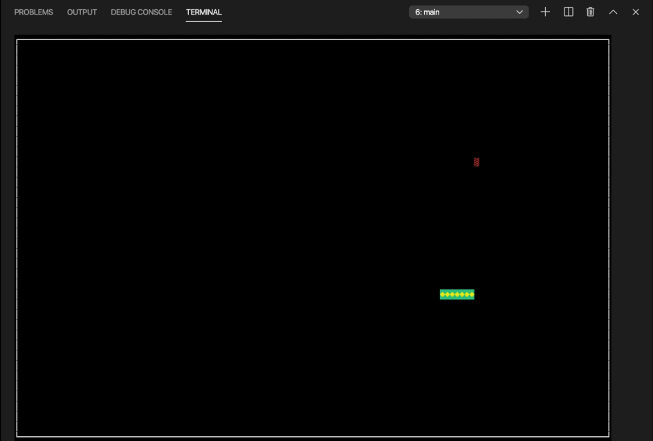

# C++ Snake Game Using Bazel and Ncurses

> Developed in Visual Studio Code

[ncurses](https://www.gnu.org/software/ncurses/) (new curses) is a  library providing a set of APIs that allows the programmer to write text-based user interfaces in a terminal-independent manner. It is a toolkit for developing "GUI-like" application software that runs under a terminal emulator. It also optimizes screen changes, in order to reduce the latency experienced when using remote shells.

## Features
- 3 different levels of difficulty
- Increasing speed as score increases
- 90's style graphics using Ncurses library
- Ability to keep track of high score for a round
- Safe multithreading using a Mutex
- Highly modular design

## Screenshot


## How to install ncurses
Well installing ncurses library is an easy task, you just have to follow the steps listed below:

### Installing ncurses on Debian/Ubuntu Linux
1. `sudo apt-get install libncurses5-dev libncursesw5-dev`

### Installing ncurses on Mac OS X
1. Install [Homebrew](http://brew.sh/) (if not already):
`/usr/bin/ruby -e "$(curl -fsSL https://raw.githubusercontent.com/Homebrew/install/master/install)"`
2. Install ncurses package: `$brew install ncurses`

### Run main:

You can run this using `blaze`:

```bash
bazel run src/main:main
```

## Ncurses Cheatsheet
You can see a quick reference of ncurses APIs [HERE](https://github.com/ourarash/ncurses_bazel/blob/master/cheatsheet.md)

## Installing Bazel

This repo uses `Bazel` for building C++ files.
You can install Bazel using this [link](https://docs.bazel.build/versions/master/install.html).

### Credit

This repo was inspired by [this post](https://www.ratanparai.com/c++/writing-unit-tests-with-bazel/).
