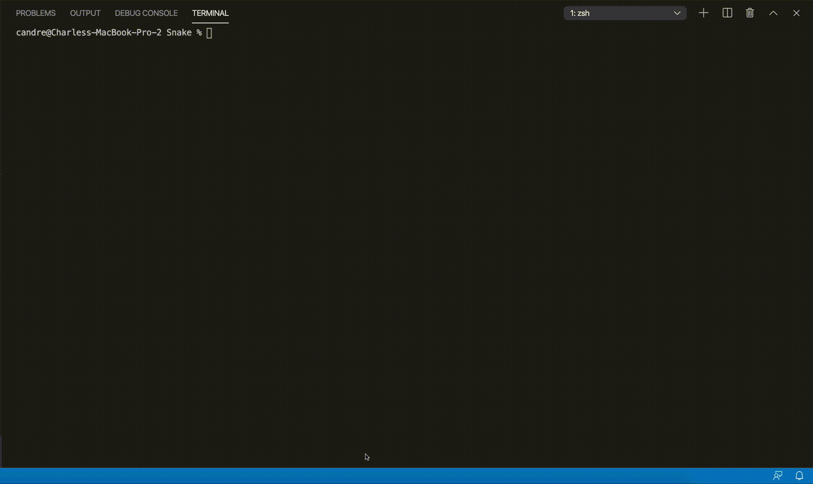

# C++ Snake Game Using Bazel and Ncurses

## Youtube Video for the Project
[Describing the Code and Showing off the features](https://youtu.be/q1sGrCArmp4)

## Compiling and Running the Game


## Features
- 3 different levels of difficulty
- Increasing speed as score increases
- 90's style graphics using Ncurses library
- Ability to keep track of high score for a round
- Safe multithreading using a Mutex
- Highly modular design

## Implementation Overview
### Main.cc
''' C++
int main() {
    do {
        Welcome_User();
        Get_Difficulty_Level();
        Init_Game_Object();
        Start_Threads(); 
        // main thread waits for game threads to finish
        Output_Score(); 
        Ask_To_Play_Again(); 
    } while(user_wants_to_play)
    Print_High_Score(); 
}
'''

### Game Class
* Provides a wrapper around key functions of the **Snake** class
* Provides functions for outputting messages to the screen
* Provides getters and setters for access to Snake member variables from main.cc

### Snake Class
* Handles safe access to *_direction* member variable via std::mutex library
* Provides logic for advancing the snake and checking the new area the snake is in each frame

## Future Work
- Multi-player
- Multi-Fruit
- Moving Fruit
- Moving this game online
- Allowing user to pause and resume the game

## About Ncurses
[ncurses](https://www.gnu.org/software/ncurses/) (new curses) is a  library providing a set of APIs that allows the programmer to write text-based user interfaces in a terminal-independent manner. It is a toolkit for developing "GUI-like" application software that runs under a terminal emulator. It also optimizes screen changes, in order to reduce the latency experienced when using remote shells.

## How to install ncurses
Well installing ncurses library is an easy task, you just have to follow the steps listed below:

### Installing ncurses on Debian/Ubuntu Linux
1. `sudo apt-get install libncurses5-dev libncursesw5-dev`

### Installing ncurses on Mac OS X
1. Install [Homebrew](http://brew.sh/) (if not already):
`/usr/bin/ruby -e "$(curl -fsSL https://raw.githubusercontent.com/Homebrew/install/master/install)"`
2. Install ncurses package: `$brew install ncurses`

### Run main using bazel:
You can run this using `bazel`:

```bash
bazel run src/main:main
```
